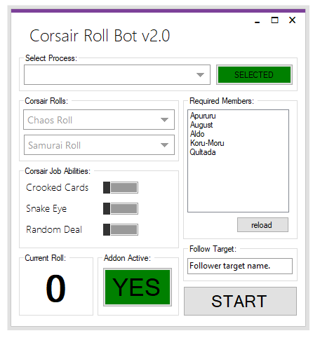

FFXI RollBot v2.0
=============

#### Automated Roll Bot for the CORSAIR job on the Online MMO Final Fantasy XI
Allows you to automate corsair rolls and job abilities.

### installation
Simply unzip the .zip file to a location on your computer, Ex. Desktop move the CRB_Addon folder to your addon directory in either Ashita or Windower and Run Corsair Roll Bot.exe as Admin.

### setup
Select the CORSAIR using the BOTTED CHARACTER groupbox combobox and click the select button next to it.

Set Roll One and Roll Two to the rolls you want.

Enable or Disable the Crooked Cards (Will be used for ROLL ONE), Snake Eye, or Random Deal toggle buttons to enable/disable the job abilities you want.

When in the required Party select reload on the REQUIRED MEMBERS groupbox to load the current PT. Check the checkboxes for the names of the characters that MUST be in range before buffing.

Type the name of the person you wish to follow if you want the CORSAIR to automatically remain within 6 yalms of that person.

Once done, press RUN BOT to beging the rollbot.

### notes
Roll data is sent through a Windower/Ashita Addon using UDP to send the data through the local internet. As such, it must be allowed access through your firewall.

### settings
Settings can be changed by enabling or disabling the toggle buttons.

### commands
None yet
